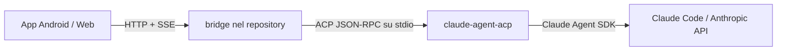

# Piano di integrazione Claude Code (CLI)

## Identità prodotto

**Harness Remote** è agnostico rispetto all'harness. OpenCode, OMP e PI sono backend selezionabili.
Aggiungere Claude Code come backend significa aggiungere una voce nell'enum `BackendKind`, un profilo
nel bridge e la sezione corrispondente nel README / help in-app.

## Decisione architetturale

Claude Code **non espone un server HTTP/SSE nativo** (≠ OpenCode) e **non supporta ACP nativamente**
(issue #6686 chiusa come `not_planned`). Ha però:

1. Un **Agent SDK ufficiale** (`@anthropic-ai/claude-agent-sdk`) TypeScript/Python
2. Un **adattatore ACP ufficiale** (`@agentclientprotocol/claude-agent-acp`) mantenuto dal team ACP

L'approccio più rapido e a basso rischio è **riutilizzare l'architettura bridge esistente** (stessa
usata per OMP e PI), aggiungendo un profilo harness che lancia l'adattatore ACP ufficiale:



L'adattatore `@agentclientprotocol/claude-agent-acp` traduce ACP in chiamate al Claude Agent SDK,
che a sua volta parla con l'API Anthropic. Il bridge non cambia affatto il suo layer ACP:
`AcpClient` e `AcpService` funzionano già con qualsiasi processo ACP-compatible.

## Modifiche necessarie

### 1. Bridge — `bridge/src/harness-profiles.js`

Aggiungere profilo `claude`:

```js
claude: {
  id: "claude",
  label: "Claude Code",
  command: "npx",
  // Pinned to avoid the `notarget` scenario that PI hit.
  args: ["-y", "@agentclientprotocol/claude-agent-acp@0.59.0"],
  permissionMode: "allow",
  capabilities: {
    ...COMMON_CAPABILITIES,
    models: false,
    todos: true,
    commands: false
  }
}
```

L'adattatore ACP ufficiale supporta: streaming, tool calls, TODO, @-menzioni, immagini,
terminali interattivi. `permissionMode: "allow"` auto-grant dei permessi (stesso pattern di OMP/PI).

### 2. Web — `web/src/types.ts`

Aggiungere `"claude"` al tipo `BackendKind`:

```ts
export type BackendKind = "opencode" | "omp" | "pi" | "claude"
```

### 3. Web — `web/src/backendCapabilities.ts`

Aggiungere mappa per `claude`:

```ts
claude: {
  sessions: true,
  prompt: true,
  abort: true,
  streaming: true,
  models: false,
  agents: false,
  todos: true,
  diff: false,
  filesystemBrowser: true,
  questions: false,
  commands: false,
  sessionRename: true,
  sessionDelete: true
}
```

### 4. Web — `web/src/backendClient.ts`

Aggiungere metadati:

```ts
claude: {
  modelSelectionRequiresSession: true,
  messageRefreshSupported: true
}
```

### 5. Web — `web/src/storageKeys.ts`

Aggiungere chiave:

```ts
claude: "opencode.remote.server.claude"
```

### 6. Web — `web/src/App.tsx`

Punti da modificare:

| Linee | Cosa |
|-------|------|
| `isBridgeBackend` | Aggiungere `backend === "claude"` |
| `backendDisplayName` | Aggiungere `"Claude Code"` |
| `defaultConfig` | Port 4097, username `claude` |
| `parseStoredConfig` | Validare `"claude"` come backend valido |
| `initialConfig` | Validare `"claude"` come backend valido |
| `backend <select>` | Aggiungere `<option value="claude">Claude Code (ACP bridge)</option>` |
| `placeholder` username | Cambiare condizione |
| Help server section | Aggiungere blocco istruzioni per Claude |
| README link | Aggiungere anchor per claude |

### 7. Bridge — test `bridge/test/harness-profiles.test.js`

Aggiungere test per il nuovo profilo.

## Cose che funzionano già senza modifiche

- `acp-client.js` — già ACP-compatible
- `acp-service.js` — già agnostico rispetto all'harness
- `server.js` — già agnostico; route condivise
- `api.ts` — già agnostico; chiama API bridge
- `opencode-events.ts` — già agnostico
- `i18n.ts` — `backendDisplayName` in App.tsx; i18n può essere aggiunto dopo

## Cose che Claude non supporta (capabilities `false`)

- **Selezione modello** → Claude usa il modello configurato localmente
- **Agents** → Claude non ha sub-agents selezionabili
- **Diff** → Claude espone file edits ma non un endpoint `/diff` strutturato
- **Questions** → Claude non ha un sistema di domande strutturate (tool permission sì)
- **Commands** → Claude ha slash commands ma su un sistema diverso da OpenCode

## Autenticazione

L'utente deve aver già fatto `claude login` (OAuth) o aver impostato `ANTHROPIC_API_KEY`
prima di avviare il bridge. L'adattatore ACP eredita le credenziali dal CLI di Claude Code.

Il bridge aggiunge Basic Auth per proteggere l'accesso HTTP; l'autenticazione ACP è gestita
dall'adattatore con `ANTHROPIC_API_KEY`.

## Porte e rete

| Backend | Porta | Schema |
|---------|-------|--------|
| OpenCode | 4096 | Diretto HTTP/SSE |
| OMP/PI/Claude | 4097 | Bridge HTTP/SSE → ACP stdio |
